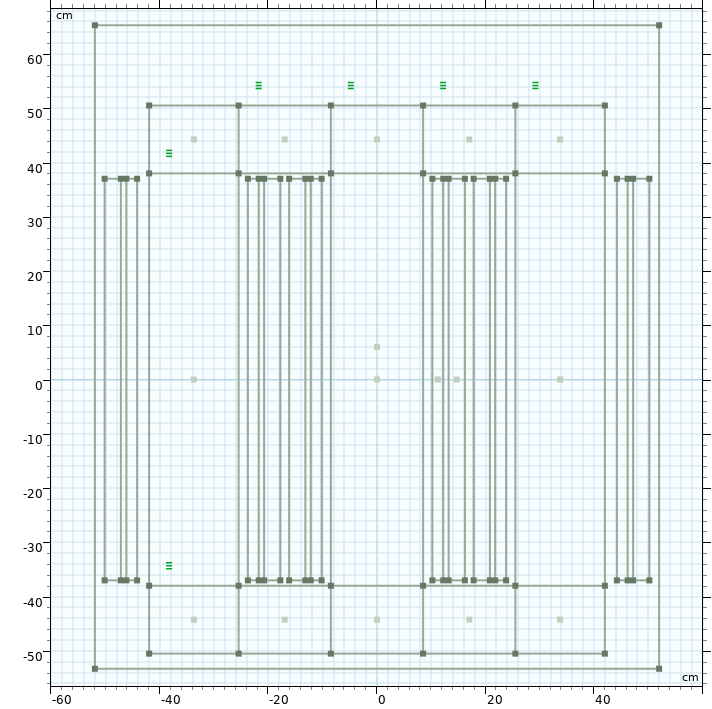
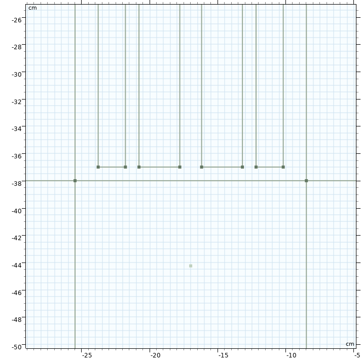
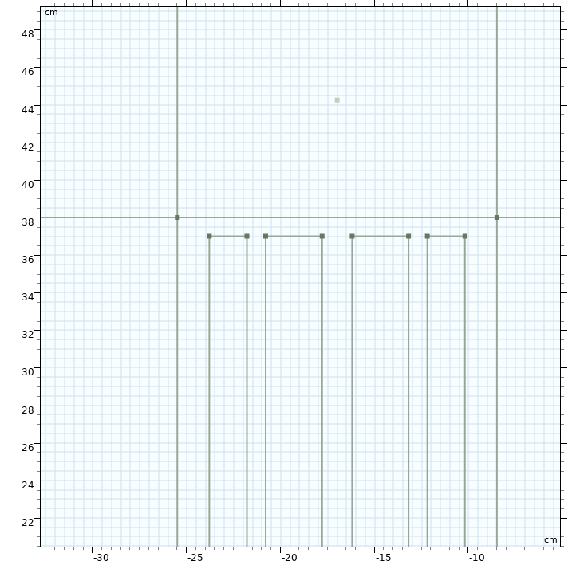

# Finite Element Methods for Electrical Engineering Applications (EE4375)

# Section 1:/ Introduction

This course consists of three blocks. 

### First Block 
In the first block we discuss the finite difference method to solve the Poisson equation in one and two spatial dimensions. We restrict ourselves to the interval and the square discretized by a uniform mesh. The Poisson equation models a diffusion process and typically appears in the computation of electrostatic and magneto-static fields. Our motivation is to introduce initial problem formulations and simplified numerical solution methods. 

### Second Block 
In the second block we discuss the variational formulation of the Poisson equation in one spatial dimension. This variational formulation allows to subsequently solve the problem by a finite element method using non-uniform meshes. We show that the versatility of the finite element method in solving problems that are more complex than in the first block. 

### Third Block 
In the third and last block we discuss the finite element solution of the Poisson equation in two spatial dimension. We discuss the mesh generation using triangle and the construction of the discrete problem using a loop over all elements. We illustrate the method in the computation of magnetostatic fields in transformers and electrical machines.  

### Assessment 
Each block will be concluded with a graded homework assignment. The three homework assignments have to be defended during the oral exam. 

### Learning Activities 
The course consists of two hours of lectures and four hours of computer lab sessions each week. We will use the programing language julia (see julialang.org) and Jupiter notebooks to develop the assignments. We will use the gmsh mesh generation software. You are kindly requested to install Julia, the Jupiter notebook system and the Julia interface to gmsh (Gmsh.jl) on your laptop. You are most welcome to give a look at the references below. 

### References for First Block
1. [wiki on the Laplace equation](https://en.wikipedia.org/wiki/Laplace's_equation)
2. [wiki on the Poisson equation](https://en.wikipedia.org/wiki/Poisson%27s_equation): including an example on electrostatics
3. [wiki on boundary value problem](https://en.wikipedia.org/wiki/Boundary_value_problem)
4. [wiki on electrostatics](https://en.wikipedia.org/wiki/Electrostatics)
5. [wiki on magnetostatics](https://en.wikipedia.org/wiki/Magnetostatics)
6. [wiki on discrete Poisson matrix](https://en.wikipedia.org/wiki/Discrete_Poisson_equation)  
7. [wiki on finite difference method](https://en.wikipedia.org/wiki/Finite_difference_method) 

### References for Second Block
1. [wiki Finite Element Method](https://en.wikipedia.org/wiki/Finite_element_method): Section 3 for the weak form and Section 4 for the finite element discretization;  
2. [Comsol Multiphysics Finite Element Method](https://www.comsol.com/multiphysics/finite-element-method): more information and illustrations; 
3. [Sphinx Finite Element Method](http://hplgit.github.io/INF5620/doc/pub/sphinx-fem/): reference for implementation;

## Section 2:/ Lectures 
Provide link to slides available at [shared drive](https://mega.nz/fm/CcsEnLxL), recordings and in-class notebooks. 

## Section 3:/ Lab Sessions
1. [first lab session](lab-sessions/first-lab-session.ipynb) and [small GMSH manual](lab-sessions/Mesh-Generation-using-Gmsh.html)
2. [second lab session](lab-sessions/second-lab-session.ipynb)
3. [third lab session](lab-sessions/third-lab-session.ipynb)
4. [fourth lab session](lab-sessions/fourth-lab-session.ipynb)
5. [fifth lab session](lab-sessions/fifth-lab-session.ipynb)
6. [sixth lab session](lab-sessions/sixth-lab-session.ipynb)
7. [seventh lab session](lab-sessions/seventh-lab-session.ipynb)

## Section 4:/ Planned Extensions 

We hired the master student Gijs Lagerweij (100 hours) to extends the course material as described below. Previous work by Gijs in context of EE4375 is describe on [Github Gijs Lagerweij](https://github.com/gijswl/ee4375_fem). 

### More pointers/exercises/support for Julia in general, Julia for FEM specifically and GMSH  

#### Julia in General 
Provide list of pointers in a Jupiter notebook on the arguments that follow: 

<b> single vs. multiple dispatch </b>

See [section Methods in the Julia manual](https://docs.julialang.org/en/v1/manual/methods/); small example on [wiki on multiple dispath](https://en.wikipedia.org/wiki/Multiple_dispatch); video [The Unreasonable Effectedness of Multiple Dispatch” by Stefan Karpinski](https://www.youtube.com/watch?v=kc9HwsxE1OY); any other video, blog post can act as a refere; ask students to read through the documentation, give an example from documentartion and give own example; 

<b> eager vs. lazy evaluation </b>

A lazily-evaluated list is a list whose elements are not evaluated when it's constructed, but rather when it is accessed.
The benefit of lazy operations is that they can be materialized in-place, possible using simplifications. For example, allows to implement BLAS-1 in place operations. Allows allocation free population of vectors using heat, vcat and copy! 
Examples from https://github.com/MikeInnes/Lazy.jl or https://github.com/JuliaArrays/LazyArrays.jl 

<b> function like objects and callable structs </b> 

See heading Function like objects in [section Methods in the Julia manual](https://docs.julialang.org/en/v1/manual/methods/); struct (data) with a method (function) associated to it; example of polynomial; ask students to read through the documentation, give an example from documentartion and give own example; 

<b> automatic differentiation </b>
See [zygote](https://fluxml.ai/Zygote.jl/latest/) and [enzyme](https://enzyme.mit.edu/julia/); 

#### Julia for FEM specifically 
Refer to grid.jl and ferritefem.jl; 
Recommend WriteVTK.jl tyo visualize the results using Paraview or use Makie instead; 

####  Extend documentation on GMSH; check what is available on the GMSH website; 
1. install and running [GMSH](https://gmsh.info); 
2. insert links to existing documentation; 
3. generate geometry (points, lines, surfaces with consequitive labels);
4. generate mesh;
5. retrieve mesh points, edges and elements from GMSH data structure in loops in notebook
6. post-process results; 

#### Add as exercises on the use of GMSH  
1. semi-circle from Victoria Hernandez (parametrize geometry with r and a, take r=0.133 m and a = 0.01 m, share figures with Gijs)
2. transformer from Max van Dijk (need to inquire dimensions, ask Max after Gijs has placed notebook online)
3. linear actuator (need to recover dimensions from papers)
4. machine from Jianning Dong (see hard drive); 

### Homework-2 - 1D FEM Model  

#### Eddy Current Assignment:  modeling part
1. explain what eddy currents are and how this effect is modeled mathematically; 
2. give expression for skin-depth; 

#### Eddy Current Assignment:  analytical part 
1. extend text of the assignment: specify geometry of air-coil-core; specify material coefficients on domain; 
2. derive equation for the z-component of the vector potential; analytical reference solution; expression for skin depth; 
3. extend documentation to cover mass matrix per element using linear elements; 
4. extend documentation to cover stiffness and mass matrix per element and assembly using quadratic elements; see notebook in part developed using Sympy; 
5. document assembly with triple loop, single loop and no loop using sparse command; 
6. extend to stiffness to spatially variable diffusion coefficient - quadrature for integration per element; 
7. provide list of pointers in a Jupiter notebook; 
 
#### Eddy Current Assignment: numerical part:  
1. generate mesh ensuring presence of nodes on subdomain boundaries; 
2. solving using first and second order elements for various current values in the coil; 
3. post-process for magnetic potential, flux B and field H;
4. compare with analytical solution for various mesh sizes for first and second order elements; 
5. sparse linear (Krylov and algebraic multigrid) solvers for large scale problems  

#### Saturation Assignment: modeling part:
1. explain what saturation is and how it is modeled mathematically; 
2. choose example of $B$-$H$ curve; show linear behavior with small and large mur value; show how to derive $\mu_r$ and $d \mu_r / d \, normB$ from the curve (derivative of a cubic spline interpolation); 

#### Saturation Assignment: analytical part:

1. add automatic differentiation in Julia to compute the sparse Jacobian;
 
#### Saturation Assignment: numerical part: 

1. solve non-linear problem without Jacobian using fixed-point iteration; linear computation as initial guess; post-process for normB; retrieve mur for non-linear material characteristic tabulated as mur vs. Mur; repeat until convergence; 

2. solve non-linear problem with Jacobian using Newton iteration; provide function for non-linear residual and  its Jacobian to non-linear system solver such as solve() or find_zeros(); computation of the Jacobian will required more attention; provide details for the linear case first; in linear case R(\vec{c}) = A \vec{c} - f and J(\vec{c}) = A; in case of the 1D finite difference method on a uniform mesh A =B^T D B independent of \vec{c} where D_j is the value of the diffusion coefficient on the j-th element; in non-linear case R(\vec{c}) = A(\vec{c}) \vec{c} - f and J(\vec{c}) = A + (dA/dc)*\vec{c}; in case of the 1D finite difference method on a uniform mesh dA/dc =B^T dD/dc B; need to provide more details on how D depends on \vec{c}; dD/dc = dD/dnormB dnormB/dc; dD/dnormB = dmur/dnormB from BH-curve interpolated using cubic splines;  need to make specific given de particular BH-curve; dnormB/dc from the expression of normB as function of c; 

3. look into packages such as zygote.jl and ChainRules; ask on discourse forum; maybe do finite differences first; provide references; 

#### Combination of Two Above Assignments: Modeling Eddy Currents in the Presence of Saturation 

### Homework-3 - 2D FEM Model

Provide options for students to choose from; 

1. three-phase distribution transformer STEDIN example (Max van Dijk master thesis): Description, mesh, assembly, solve, include field-circuit coupling; post-processing  

2. modeling of rotating machine (GMSH input available): geometry definition including motion 

3. linear actuator (GMSH inputy to be defined) with implementation of physics described in HW2. 

4. Contactless energy transfer - Litz wire 

5. Telsa Model 3 S Motor: https://www.youtube.com/watch?v=esUb7Zy5Oio

## Section 5:/ Examples on the use of GMSH 

[Seven Examples from tutorials/julia](https://gitlab.onelab.info/gmsh/gmsh/-/tree/master/tutorials/julia)

[Examples within JuliaFEM](https://github.com/JuliaFEM/Gmsh.jl): see test-directory for two examples; mesh on triangle; mesh on other examples

[Examples on stackexchange](https://scicomp.stackexchange.com/questions/30169/connectivity-matrix-in-finite-element-method-in-triangular-elements): small mesh om square geometry; 

## Section 6:/ Details three-phase distribution transformer 
In this section we described the three-phase distribution transformer considered in the [master thesis of Max van Dijk](https://repository.tudelft.nl/islandora/object/uuid%3A15b25b42-e04b-4ff2-a187-773bc170f061?collection=education). We plan to 
1. define geometry and mesh using GMSH; provide labels for subdomains and subboundaries;
2. discretize and solve using gridap.jl (or alternative);
3. discretize and solve using home-brewed using P1 and P2 elements; 
4. post-process using Makie.jl or alternative; 

 

