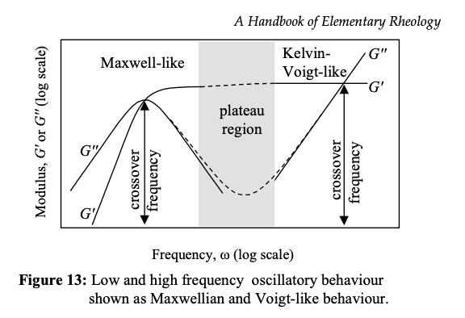

# Making Mayonaise 

To do: 
1. extend with figure of computed streamlines in rheometer.
2. look for suitable data in [pyRheo](https://github.com/mirandi1/https://github.com/mirandi1/pyRheo).
3. add chapter 5 of book of [Lapasin and Pricl](https://link.springer.com/chapter/10.1007/978-1-4615-2185-3_5)

## Section 1: Introduction 
 
The goal of this project is to study fluids often encountered in the food processing industry. 

Dressings, sauces and mayonaises are typically be described as [emulsions](https://en.wikipedia.org/wiki/Emulsion) obtained by mixing oil and water. Industrial partners in this project are eager to further develop modeling and simulations techniques to obtain a better grip on the batch production and long term storage of emulsions. This grip is obtained by a better understanding of the physical properties of the mixture in terms of the properties of the oil and water components. This is the field of [rheology](https://en.wikipedia.org/wiki/Rheology). 

We will consider [mayonnaise](https://en.wikipedia.org/wiki/Mayonnaise) as an emulsions obtained by mixing oil droplets in water. These emulsion can be described as [linear visco-elastic materials](https://en.wikipedia.org/wiki/Viscoelasticity). An important physical property in the study of emulsions is the [dynamic modulus](https://en.wikipedia.org/wiki/Dynamic_modulus). The modulus is defined as the ratio of stress to strain under vibratory conditions. Given that strain is dimensionless, the dynamic modulus has the same units as stress (units Pa = N/m$^2$). The dynamic modulus is complex-valued quantify. The real part is called the storage modulus (reflecting recoverable energy) and represents the elastic portion of the material. The imaginary part is called the loss modulus (related to energy dissipation) and represent the viscous part of the material. Our interest is understanding how the dynamic modulus of mayonaise dependent on its ingredients and how it evolves over the shell live time. 

Representative values of the dynamic modulus: 
1. water: the dynamic modulus of water is approximately 2.1 to 2.2 GPa (hard to compress);
2. milk: between 500 MPa and 2500 MPa. See e.g. Ozer-1998, <i>Gelation Properties of Milk Concentratedby Different Techniques</i>;
3. butter: see e.g. [link](https://www.rheologylab.com/articles/food/butter-v-margarine-spread/);  

The <b>use of the Julia programming language</b> is an integral part of the learning objectives of this project. The spatial resolution required in this project leads to large scale linear systems. These large scale systems are cumbersome to solve without use of a compiled programming language. Julia merges the easy of use (Python like) with the speed of execution (C++) like. 

## Section 2: Oil Mixture Fraction and Visco-Elastic Properties of Emulsions 

The dynamic modulus of mayonaise depends on (among many others factors) the types and amount of oil used. The dynamic modulus can be both measured experimentally and modeled mathematically. 



### Measuring the Strength of Mayonaise 

The dynamic modulus of mayonaise can be measured using [dynamic mechanical analysis](https://en.wikipedia.org/wiki/Dynamic_mechanical_analysis) (general term) and [rheometry](https://en.wikipedia.org/wiki/Rheometry) (more specific terms). This [video](https://www.rheologylab.com/videos/) explains oscillatory stress sweeps. 

1. picture of weak and strong mayonaise;
2. provide figures for $G'(\omega)$ and $G''(\omega)$: explain that sample breaks down at sufficiently large frequencies as sample no longer allowed to restore from exitation, multiple relaxation times).

See seperate notebook [Experimental_Data_in_Python_Code](Experimental_Data_in_Python_Code.ipynb) for experimental data of dynamic modulus of various mayonnaise types. (to do: add plots and highlight the plateau zone). 

Can this experimental data be modeled using [pyRheo](https://github.com/mirandi1/https://github.com/mirandi1/pyRheo) or [rheofit](https://rheofit.readthedocs.io/en/latest/index.html)? 

### Modeling the Strength of Mayonaise  

1. single relaxation time [Kelvin-Voigt model](https://en.wikipedia.org/wiki/Kelvin–Voigt_material) (parallel spring-dashpot) (attempt to solve in time-domain first)? 
2. single relaxation time [Maxwell model](https://en.wikipedia.org/wiki/Maxwell_model) (series spring-dashpot)  

### Mason-Scheffold-2014 Model

We suggest to start the project the studying the 2014 paper by Mason and Sheffold. This paper is unique is deriving an expression for the dynamical modulus. In a particular frequency range, the storage modulus can be consider to be constant. This value is refered to as the plateau elastic modulus. 

We suggest to rephrase 
1. the model (the minimization of sum of total free energy, i.e., the sum of entropic and interfacial energy);
2. the solution approach (finding first order critical points) and;
3. the results obtained (small and large plateau elastic modulus at small and large oil mixture fraction);

Assume a mono-disperse oil-in-water emulsion subject to a shear strain with value $\gamma$. 
1. $N$: number of droplets; 
1. $a$: oil droplet radius, in the order of nano-meters (nano-emulsions) or micro-meter (micro-emulsions);
2. $V_{drop} = 4 \pi \, a^3 / 3$: volume of droplet;  
3. $\phi$: droplet mixture fraction for oil-in-water emulsion;
4. $\phi_c$: threshold value of $\phi$ for jamming. In the range $0.6 \leq \phi_c \leq 0.7$. Paper uses $\phi_c = 0.64$; 
5. $\phi'_c > \phi_c$: new and larger value for the threshold value of jamming;
6. $\phi_d = \phi'_c - \phi_c$: deformation mixture fraction. Precise value is given by imposing equilibrium in energy contributions; 
7. $\sigma$: oil in water [interfacial tension](https://www.youtube.com/watch?v=2BBHl8Zvs2U&t=40s) of the droplets, in the order of miliNewtons/meter. $\sigma/a$ is the Laplace pressure scale. Q: is this value independent of the strain applied to the system?;
8. $G'_p(\phi)$: linear (or plateau) shear [elastic modulus](https://en.wikipedia.org/wiki/Elastic_modulus) (as opposed to Youngs or bulk modulus). Also referred to as effective spring constant. Clearly independent of frequency of shearing force. Assumption is that the emulsion is in the state in which the shear tension responds linear to the shear rate. In this state the definition as second order derivative applies;
10. $\Pi(\phi)$: [osmotic pressure](https://en.wikipedia.org/wiki/Osmotic_pressure)
11. $F(\phi,\gamma)/N$: free energy per particle

#### Scaling laws based on [Surface Evolver](https://kenbrakke.com/evolver/evolver.html) 
1. scaling laws for $G'_p(\phi) \sim \sigma/a \, \phi \, (\phi-\phi_c)$;
2. scaling laws for osmotic pressure $\Pi(\phi) \sim \sigma/a \, \phi^2 \, (\phi-\phi_c)$

#### Scaling laws based on jamming simulations  
1. scaling laws for $G'_p(\phi) \sim \sigma/a \, [ \phi^{8/3} \, (\phi-\phi_c)^{0.82} + \phi^{5/3} \, (\phi-\phi_c)^{1.82} ]$;

#### Entropic Free Energy

1. how is entropic free energy defined? $F_{entropic}(\phi,\gamma)/N = - T \, \Delta S$ where $S$ is the entropy given by $S = k \, \log(\Omega)$, where $k$ is the Boltzman constant and $\Omega$ in the number of microstate (number of droplets). See e.g. [entropic free energy](https://en.wikipedia.org/wiki/Entropic_force). 
2. give small example illustrating this definition? 
3. how should definition applied in current context? 
4. here $ F_{entropic}(\phi,\gamma)/N = -3 \, k_B \, T \, \log[ \phi_c + \phi_d - \phi - \alpha \, \gamma^2] $ and its application to colloidal systems (same wiki link). See also [Depletion_force](https://en.wikipedia.org/wiki/Depletion_force); 
5. give interpretation of the result obtained; 

#### Interfacial Free Energy

1. how is interfacial energy defined? $F_{interfacial}(\phi,\gamma)/N = \sigma \, \Delta A$ where $\sigma$ is the Laplace pressure; 
2. give small example illustrating this definition? 
3. how should definition applied in current context?
4. interfacial energy: here $A = 4 \, \pi \, a^2 \, \left[ 1 + \xi \phi_d^2 + \ldots \right]$ and thus $\Delta A = 4 \, \pi \, a^2 \, \xi \, \phi_d^2$. Thus $ F_{interfacial}(\phi,\gamma)/N = 4 \, \pi \, \sigma \, \xi \, a^2 \, \phi_d^2 $. See also information on [surfactants](https://en.wikipedia.org/wiki/Surface_tension) and [interfacial_rheology](https://en.wikipedia.org/wiki/Interfacial_rheology); 
5. give interpretation of the result obtained; 

#### Total Energy 

$ F_{total}(\phi,\gamma)/N = F_{entropic}(\phi,\gamma)/N + F_{interfacial}(\phi,\gamma)/N$

#### Energy Minimization 

First order critical point $\left. \frac{\partial F_{total}}{\partial \phi_d}\right|_{\phi_d = \phi_d^*} = 0$ (entropic and interfacial force balance) determines the optimal deformation volume fraction $\phi^*_d$. 

Define $ \phi_T^2 = \left( \frac{3 k_B T}{a^3} \right) / \left( 2 \pi \xi \frac{\sigma}{a} \right)$. 

Optimal mixture fraction 
$\phi_d^* = \frac{1}{2} \left\{ [\phi - (\phi_c - \alpha \gamma^2)] + \sqrt{ [\phi - (\phi_c - \alpha \gamma^2)]^2 + \phi_T^2 }\right\}$ 

#### Thermodynamical derivative

Expand on thermodynamical derivatives and provide examples. 

#### Computation of osmotic pressure $\Pi$

Compute osmotic pressure as first order thermodynamical derivative of total free energy wrt the applied shear strain, i.e., 

$ \Pi = \frac{\phi^2}{N V_{drop}} \frac{\partial F_{total}}{\partial \phi_d} \text{ arguments missing}$

#### Computation of plateau shear modulus $G'_p$ 

$ G'_p = \frac{\phi}{N V_{drop}} \left. \frac{\partial^2 F_{total}}{\partial \gamma^2} \right|_{\phi_d = \phi_d^*, \gamma = 0} $ 

Replace in expression for total free energy $\phi_d$ by $\phi^*_d$ and compute the second order derivative of the resulting expression wrt $\gamma$.

See seperate notebook [mason-sheffold-2014.ipynb](mason-sheffold-2014.ipynb).

### Mason-Scheffold-2014 Measured Values 

### Mason-Scheffold-2014 Compare Model and Measured Values  

## Section 3: Complement Understanding of the Problem 

We suggest to further improve the understanding of concepts introduced by Mason-Sheffold-2014 by complementing with material from other sources. We suggest consulting e.g. the 1999 book by Russel, Saville and Schowalter entitled “Colloidal Dispersions”. 

## Section 4: Beginner Level: Oil Droplet Size and Visco-Elastic Properties

The framework introduced by Mason-Sheffold-2014 is limited to mono-disperse emulsions in which all oil droplets have the same diameter. Motivated by practical applications, we wish to extend the Mason-Sheffold-2014 model to poly-disperse emulsions. 

### Extension of the Energy Minimization Model 

A first alternative to is to first generalize the expression for the entropic and interfacial free energy to a weighted sum of energy contributions valid for a mixture of oil droplet sizes. Subsequently, one needs to determine the critical mixture fraction that determines the equilibrium of the configuration. Finally, one can determine the plateau shear modulus by the second derivative of the total free energy with respect to the strain rate. 

### Particle Based Models

A second alternative is to replace the energy minimization framework by a mechanical model of a number of oil drops interconnected by springs, dashpots and dampers. One wishes to study the stress response of these systems given as oscillatory shear. Possibly one can start by considering interconnections (networks or graphs) of Kelvin-Voight and Maxwell models. Possibly one can borrow ideas from molecular dynamics or other particle-based simulations methods.

<b>Example of a Particle Based Model</b> [computation of the viscosity](https://docs.lammps.org/Howto_viscosity.html) by ensemble averaging of the auto-correlation of the stress/pressure tensor using [LAMMPS](https://docs.lammps.org/Manual.html). Another example is [Measuring the distribution of interdroplet forces
in a compressed emulsion system](https://hmakse.ccny.cuny.edu/wp-content/uploads/2015/07/2003_Measuring.pdf)

### Continuum Models 

A third alternative is to study computational fluid dynamics models of the rheometer that determines the plateau shear modulus. One thus needs to solve a rotating lid-driven cavity Stokes flow model for a shear-thinning non-Newtonian fluid.  

## Section 5: Intermediate Level: Lid-Driven Cavity Stokes Flow for Shear-Thinning Non-Newtonian Fluid

### Section 1.5: Newtonian Fluid 

Perform lid-driven cavity Stokes flow simulations with translation shear for Newtonian fluid. 

<b>Coding</b>: see seperate notebook [ferrite_stokes_lid_driven_square.ipynb](./ferrite_stokes_lid_driven_square.ipynb) (in progress). 

### Section 2.5: Non-Newtonian Fluid

Perform lid-driven cavity Stokes flow simulations with translation shear for visco-elastic (non-Newtonian) fluid with shear-thinning behavior. Extend previous case by e.g. a power-law for the viscosity by modifying the [Ferrite Hyperelasticity Tutorial](https://ferrite-fem.github.io/Ferrite.jl/stable/tutorials/hyperelasticity/).  

See e.g. [example](https://link.springer.com/chapter/10.1007/978-981-97-7759-4_42) of the kind of result we would like to obtain (to elaborate further). 

## Section 6: Expert Level: Rotating-Lid-Driven Cavity Stokes Flow for Shear-Thinning Non-Newtonian Fluid

(Include schematic representation from the book).  

### Section 1.6: Pre-Processor 

The preprocessor consist of the following two components: 

1. geometry modeling tool;
2. mesh generation tool;  

The first component is the geometry modeler.  This modeler is either implements a form of [constructive solid geometry](https://en.wikipedia.org/wiki/Constructive_solid_geometry) or allows to import a geometry definition from file in standard definition. 

The second component is the mesh generation tool. Here we use [GMSH](https://gmsh.info). 

Here, the preprocessor should generate a mesh on the cylindrical cavity of the rheometer in which the sample resides. 

<b>Coding</b>: see seperate notebook [gmsh_cavity.ipynb](gmsh_cavity.ipynb).

## Section 2.6: Computational Kernel 

The computational kernel assumes the responses of the sample to the excitation of the rheometer to be modeled in terms of physical laws of conservation (conservastion of mass and momentum) and constituive laws of the material (stress-strain relation). Given these models, the computational kernel consists of the following three four components: 

1. read the mesh;
2. discretize the conservation and constitutive equations in space and time;
3. solve the discrete model in space and time;
4. write snapshots for spatial distribution of velocity, strain and stress to file for visualization;
   
Simulations reported here were performed using the [Ferrite](https://ferrite-fem.github.io/Ferrite.jl/stable/) finite element software.

### Section 3.6: Scalar Diffusion 

A elementary proof of concept is to solve a scalar diffusion eqiation on the volume (computational domain) of a cylindrical cavity. 

<b>Coding</b>: see seperate notebook [ferrite_diffusion_cavity.ipynb](ferrite_diffusion_cavity.ipynb).

### Section 4.6: Stationary Stokes Flow of a Newtonian Fluid 

Here we consider the rotation of the lid covering the cylindrical cavity to be modeled by a overly simplified [Stokes flow](https://en.wikipedia.org/wiki/Stokes_flow) model for a [Newtonian fluid](https://en.wikipedia.org/wiki/Newtonian_fluid).  

<b>Coding</b>: see seperate notebook [ferrite_stokes_cavity.ipynb](ferrite_stokes_cavity.ipynb). 

### Section 5.6: Transient Navier-Stokes Flow of a Newtonian Fluid

Here we extend flow Stokes to [Navier-Stokes flow](https://en.wikipedia.org/wiki/Navier–Stokes_equations), thus including non-linear convective terms. We also include time-dependent terms;

<b>Coding</b>: see seperate notebook [ferrite_navier_stokes_cavity.ipynb](ferrite_navier_stokes_cavity.ipynb) (in progress).

### Section 6.6: Post-Processor 

Resultsa are visualized using [paraview](https://www.paraview.org). 

### Section 7.6: Preliminary Results 

Here we show computational results for the magnitude of the velocity for Stokes flow. 


## Section 7: Introductory material on the Julia Programming Language

- Elementary introduction: [Thinking Julia](https://benlauwens.github.io/ThinkJulia.jl/latest/book.html);
- Aalto Short Course: [julia-introduction](https://github.com/AaltoRSE/julia-introduction); 
- Video Collection by Chris Rackauckas: [link](https://www.youtube.com/playlist?list=PLCAl7tjCwWyGjdzOOnlbGnVNZk0kB8VSa) 
- Pointer to lots of goodies: [Nouvelles Julia](https://pnavaro.github.io/NouvellesJulia/pages/2022_03.html);

## Section 8: References 
1. Mason-Sheffold-2014; 
2. Russel, Saville and Schowalter, “Colloidal Dispersions”; 
3. master thesis [Wei Fan](https://repository.tudelft.nl/record/uuid:acbfbd35-3ab1-4ec2-9a7b-b3098bdfcea9);
4. Tabilo-Munizags-2005: provides good overview.
5. Barnes-1994: Rheology of Emulsion - A review: provides good introduction
6. Barnes-2000: [Handbook_of_Rheology](https://ia601206.us.archive.org/4/items/HandbookOfRheology/Handbook_of_Rheology.pdf) - valuable resource;
7. [rheoTool](https://github.com/fppimenta/rheoTool)
8. slides by D. Lahaye;

### Books 
1. Owens and Phillips, <i>Computational Rheology</i>, Imperial College Press, 2005, [link](https://www.worldscientific.com/worldscibooks/10.1142/p160?srsltid=AfmBOorG7vsoNkHySUFhak1hYmUAA6EA8blCSgBJHpqgR_dqwpRwgoRm#t=aboutBook).  
2. Belitz, Grosch and Schieberle, <i>Food Chemistry</i>, Springer, 2009, [link](https://www.google.nl/books/edition/Food_Chemistry/xteiARU46SQC?hl=en&gbpv=0);
3. Hasenhuettl and Hartel, <i>Food Emulsifiers and Their Applications</i>, Springer, 2019, [link](https://www.google.nl/books/edition/Food_Emulsifiers_and_Their_Applications/5Ea9DwAAQBAJ?hl=en&gbpv=0); 


### Videos 
1. [What is an emulsion? by Silverston](https://www.youtube.com/watch?v=mBvKar6t1LY): mixing by high shear to reduce surface tension;  
2. [The emulsification process by Jacob Burton](https://www.youtube.com/watch?v=qnudmk_63r4): viscosity as a stabilizer; 
3. [What is an emulsion by Dow](https://www.youtube.com/watch?v=uWfdU92uPNY) phases separate to find state with lesser energy; 


```julia

```


```julia

```


```julia

```
