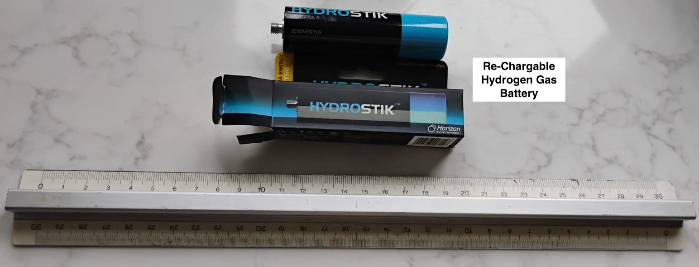
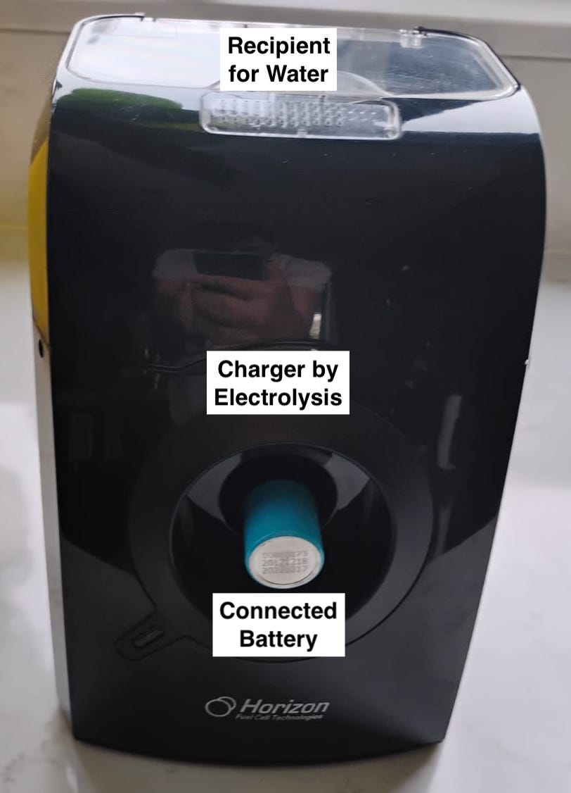

# Building the Hydrogen Storage Infrastructure in the Arabian Gulf Region using Metal-Organic Frameworks

### Domenico Lahaye, Delft Institute of Applied Mathematics, Technical University of Delft, d.j.p.lahaye@tudelft.nl
### Valentina Olabi, Gulf Petrochemical Chemical Association, valentina@gpca.org.ae
### Rudy Paiman Sadi, Almajdouie - de Rijke, Kingdom of Saudi Arabia; sadirp@almajdouie.com 

## Section 1: Introduction

The aim of this project is to contribute to the deployment of hydrogen gas as a sustainable fuel in the Arabian Gulf. This includes the design of infrastructure for storage, transport and distribution of hydrogen. Other goals are looking into alternative modes of transport and energy prodiuction that accelerate the adoption of hydrogen as energy carier. Mathematical modeling techniques and numerical simulation tools are expected to provide indispensable insight allowing to compare various scenarios.

In the Arabian Gulf, the joint use of solar and wind energy is expected to play a crucial role in the production of sustainable (green) hydrogen gas.  Hydrogen opens the perspectives to replace hydro-carbon fuels and to allow for clean combustion without pollutant formation. This combustion can supply energy in various ways. It can generate heat (household boilers), drive the generation of electricity (see e.g. recent studies on (micro) gas turbine engines) and be used as a fuel in internal combustion engines or fuel cells for cars and trucks. Hydrogen, however, has a small molecular size and low density. The storage of hydrogen (at e.g. low temperatures and high pressure) is therefore a well-known technical challenge. 
 
This project intends to study solutions for the storage of hydrogen. Both small (individual households, personalized trasnsport) and large scale storage (industrial, residential, mass transport) systems can be examined (quantify small and large, amount of hydrogen fuel and storage capacity). The batteries proposed will be adapted to local  circumstances in the Arab Gulf.  Here solar energy is abundantly available in large flat dessert areas. This energy can be harnessed to produce, store and discharge hydrogen. 
 
This project aims to investigate alternative hydrogen utilisation and storage techniques in the Arabian Gulf region. In Section 2, we give an overview of existing hydrogen storage techniques. In Section 3, we describe the utilisation of Metal Organic Frameworks (MOFs) as the potential future solution to wide-scale hydrogen storage.

## Section 2: Metal-Organic Frameworks for Hydrogen Gas Storage 

The storage of hydrogen is not without technical difficulties due to its [chemical properties](https://en.wikipedia.org/wiki/Hydrogen). Options for hydrogen storage are listed at [hydrogen_storage](https://en.wikipedia.org/wiki/Hydrogen_storage). In this project we will look into storage using metal-organic frameworks. These material are able to bind hydrogen. The process can be explained by a [Langmuir_adsorption_model](https://en.wikipedia.org/wiki/Langmuir_adsorption_model). A scale model (courtesy of [Horizon Fuel Cell Technologies](www.horizonfuelcell.com)) is shown below. 


Fig 1: Rechargeable hydrogen gas battery. 

Fig 2: Electrolyzer. 

For a discussion of how this technology is currently used in the automotive industry, see e.g. the video [what is a hydrogen fuel cell vehicle](https://www.youtube.com/watch?v=rzdBHr3v5mc).  

## Section 3: Project Stages 

The project is subdivided into the following stages. 

### Literature Study 

Consider battery for truck, forklift or similar vehicle; 

1. find and read relevant sources. Read on factors such as storage capacity, weight, (de-)charging times and temperatures, paratic losses, safety concerns, risk for corrosion, risk for fire and cost;
2. summarize in own wording; 
3. develop mathematical model (PDE, boundary conditions and initial conditions) for flow, heat and chemical reactions; 
4. obtain educated guesses for model outcome; 
5. discuss information collected with project partners; 

References include
- <i>New Approaches to Hydrogen Storage - Tutorial Review</i> by Jason Graetz, Chemical Society Reviews, 2008. 
- <i>Hydrogen Storage Materials - The characterisation of Their Storage Properties</i> by Darren P. Broom, Springer, 2011. 
- papers in International Journal of Hydrogen Energy;  

### Mathematical Modeling and Numerical Simulation 

<b>Convection-Diffusion-Reaction Model Assuming Simplified Flow Conditions</b>

Chemical reaction of absorption and desorption in absence of flow or assuming simplified plug-flow of hydrogen gas through the reactor. Examples include [NonlinearPoisson2D Reaction Tutorial in VoronoiFVM](https://j-fu.github.io/VoronoiFVM.jl/stable/module_examples/Example210_NonlinearPoisson2D_Reaction/) (finite volume with first order upwind for the convective term (?)) and [Reactive_Surface Tutorial in Ferrite](https://ferrite-fem.github.io/Ferrite.jl/stable/tutorials/reactive_surface/) (finite element include stabilization for the convective term). 

<b>Laminar Flow in Porous Media Model Assuming no Chemistry</b>

Laminar flow (conservation of mass and momentum) through void and porous media metal-oxide (Darcy Law) filled spaces assuming no absorption or desorption takes places. Examples include [Incompressible Navier-Stokes tutorial in Ferrite](https://ferrite-fem.github.io/Ferrite.jl/stable/tutorials/ns_vs_diffeq/). 

<b>Combination of Two Previous Models</b>
Combine model of laminar flow with chemical reactions into a single model.   

### Study Visit to the Arabian Gulf 

1. verify findings, place findings in broader context; 

### Report and Presentation 

## Section 4: Mathematical Modeling and Numerical Simulation 

More details on the mathematical modeling and numerical simlation using the [Julia](https://julialang.org) programmibng language are given in a seperate notebook on [absorption of hydrogen](darzi-2016.ipynb). 

## References  

1. List more references here; 
2. [Liquid_organic_hydrogen_carriers](https://en.wikipedia.org/wiki/Liquid_organic_hydrogen_carriers) 


```julia

```
